# Githubの使い方

サイボウズの社内サイトはGithubを使用してサイト更新、バージョン管理を行っています。  
対象のサイトは以下になります。

---

## Gitとはそもそも何か？
ソースコードやファイルの変更履歴を記録し、バージョンを過去のものに戻したりすることができるバージョン管理ツールです。  
今までは集中型管理システム（SVN）を使用していましたが、Gitは分散型バージョン管理システムになります。
分散型バージョン管理システムの場合は、リポジトリを複数に分けることができることから分散型と呼ばれています。

---

## GitとGithubの違い
Gitはバージョン管理ツール、GithubはGitを使用したwebサービスのことを指します。

---

## Gitの仕組み
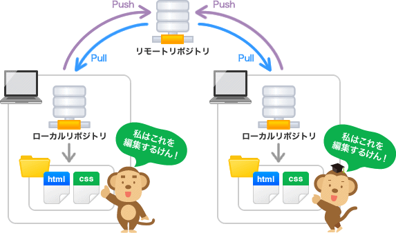

※サルでもわかるGit入門(http://www.backlog.jp/)から引用

## 最低限覚えておくべき用語

- リポジトリ（repository） … 履歴管理を行う場所。
- リモートリポジトリ（remote repository） … サーバーにあるリポジトリ。
- ローカルリポジトリ（local repository） … 自分のPCにあるリポジトリ。
- ブランチ（branch） … 履歴管理を枝分かれさせてたもの。ブランチを使うこちにより、複数の履歴を並列に管理できる。
- クローン（clone） … リモートリポジトリをコピーしてローカルリポジトリを作成すること。
- プル(push) … リモートリポジトリの変更をローカルリポジトリに反映させること。
- プッシュ（pull） … ローカルリポジトリの変更をリモートリポジトリに反映させること。
- コミット（commit） … インデックスに登録してある変更対象をローカルリポジトリに反映すること。
- プルリクエスト（pull request） … フォークしたリポジトリでの変更を、フォーク元のリポジトリへ反映するよう依頼すること。
- マージ（merge） … 異なるブランチの変更を反映させること。お互いの変更履歴が残る。
- コンフリクト（conflict） … マージ対象の２ファイルで同じ箇所が変更されており、自動でマージができないこと。
- フェッチ(fetch) … リモートリポジトリの変更をローカルリポジトリに反映させること。

---

## 作業ブランチ→テスト環境（develop）→本番環境（master）反映までの一連の流れ

※今回は分かりやすいようにGUIツール（Github Desktop）を使用した更新方法で説明します。

### ①更新対象のリポジトリをクローンする

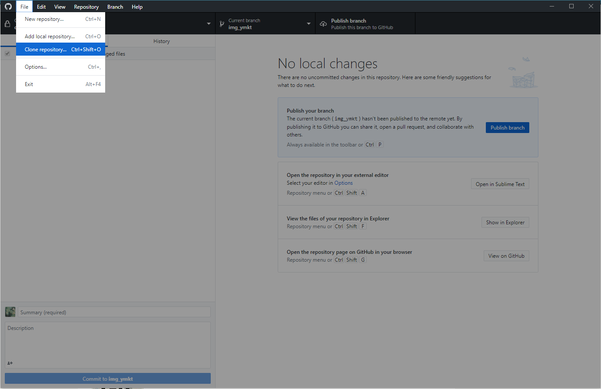

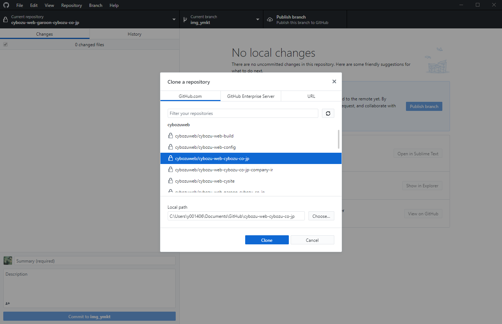

### ②作業用のブランチを作る（専門用語でブランチを切るといいます）
※その時、どのブランチのデータをベースにするのか聞かれるので、作業ブランチの段階ではdevelopを選択する

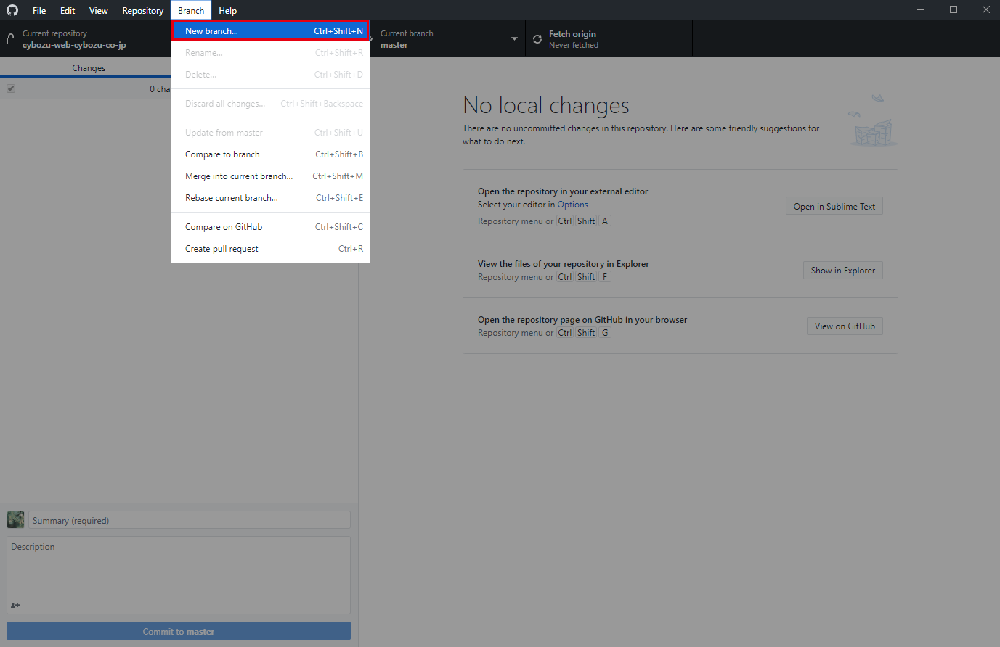

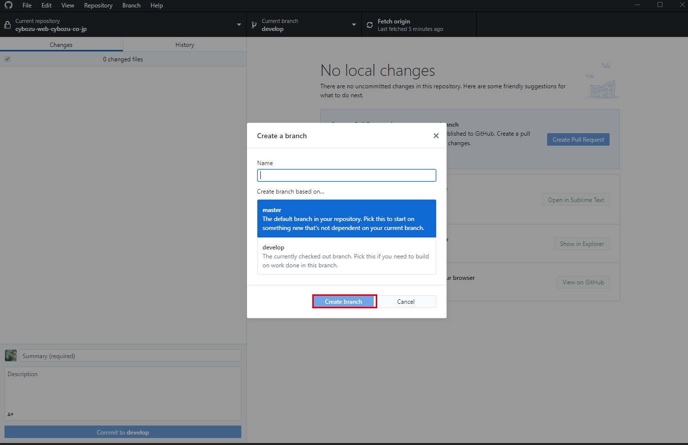

### ③ファイルを修正する

### ④Github Desktop上で変更したファイルがインデックスされるので、変更内容を記載して左下のコミットボタンを押下する。
- ※何を変更したのか分かるようなコメントを簡潔に書いてください。（バージョン、変更箇所、変更理由など。

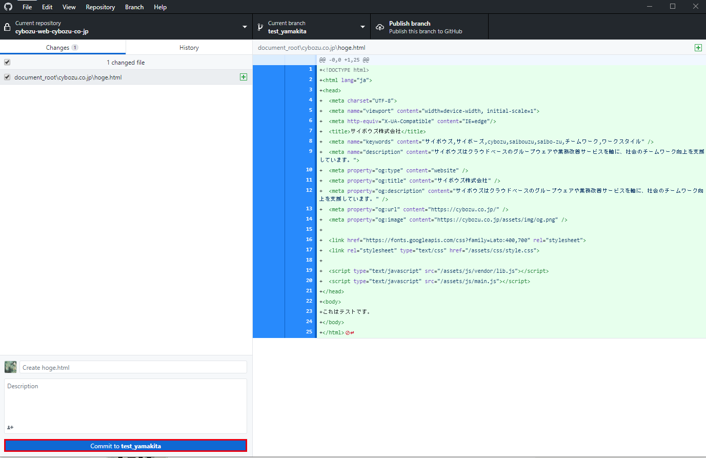

### ⑤上のバーの「push origin」ボタンを押下してpushする

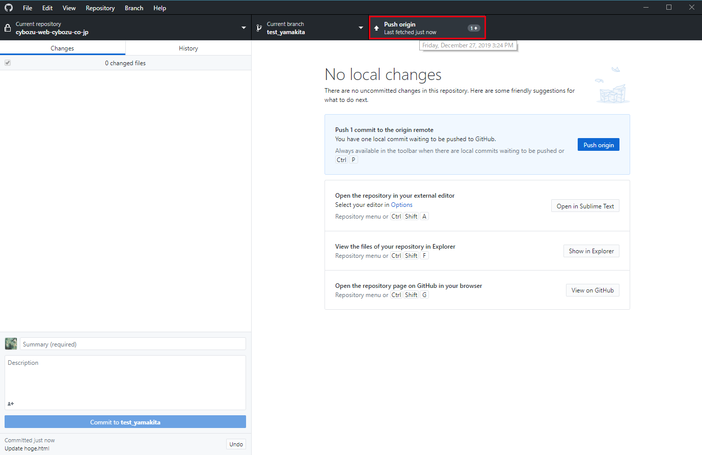

### ⑥githubに移動すると、pushした対象のブランチ名が表示されているので、「compare & pull request」を押下

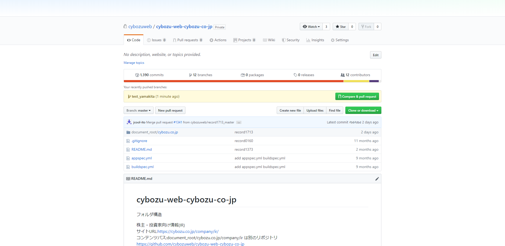

### ⑦プルリクエストの画面に遷移するので、反映させるブランチを選択し、右下の「create  pull request」を押下。
※この時、ブランチ選択タブの横に「Able to merge」と表示されていたらプルリクエストができる状態。
- コンフリクトすると別の表示になる。

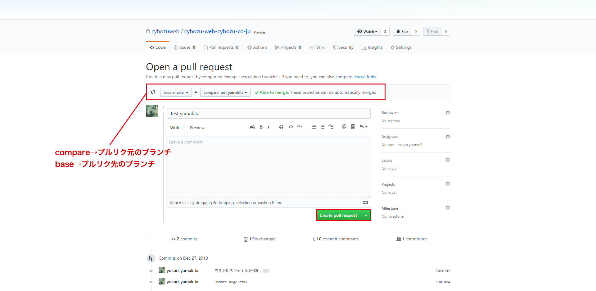

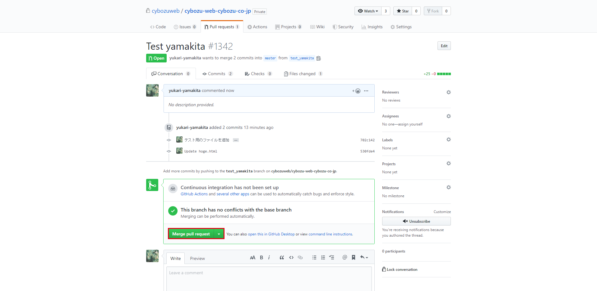

### ⑧「confirm merge」を押下すると、プルリクエストが送られ、サイト上に反映される

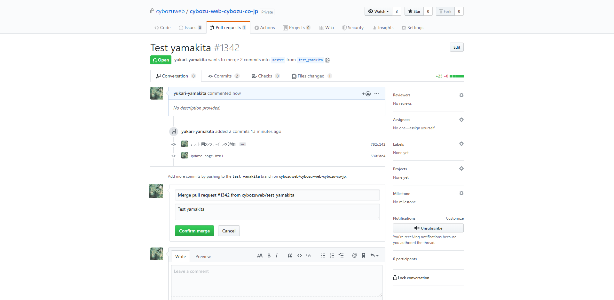

### ⑨テスト環境での確認がOKであれば、※の作業の繰り返し。テスト環境（develop）→本番環境（master）へプルリクエスト